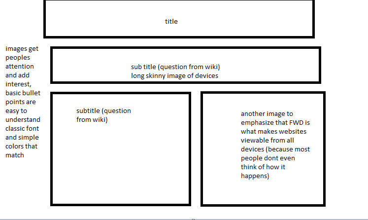

-What is the information this page aims to deliver? The goal is to give viewers insight to RWD ( a term I hadn't heard of before taking this class, but a concept that I use everyday with my laptop and phone)

-What is the first information on the page that should draw the eye? The title ( RWD and the images with phone tablet and computer)
-What is the primary content of this page?
text answering basic questions posed by titles/subtitles
-What is the secondary content?
images that compliment and help further explain what FWD is

-In my page you find A standard title,
two standard text boxes answering two of the questions on our hw wiki and two images
- with a light pink color scheme to match the pink that exist in the images I chose prior to creating my webpage.

